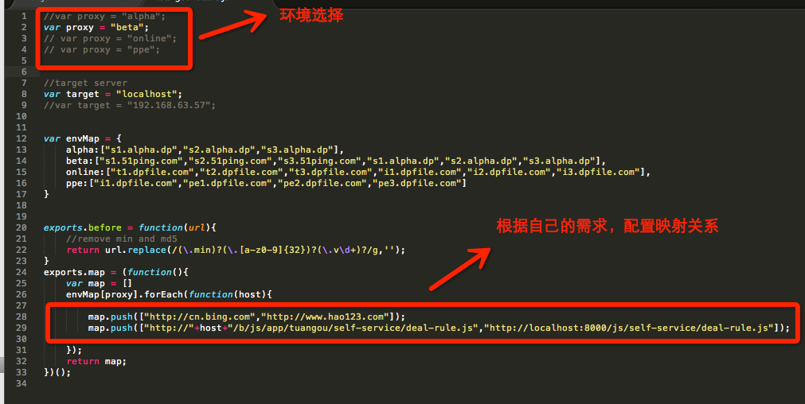

title: 商家平台及相关——本地代理设置
date: 2015-09-09 17:50:17
tags:
 - 工作
---

本地代理，避免每次写完一段代码都要push到beta上才能看效果。
============
一：旧项目(neuron)的本地代理设置
============
页面上的静态引用使用的都是绝对地址，比如t1.dpfile.com或者s1.51ping.com这样的域名，
代理的作用是当浏览器访问到这些域名的时候，会请求到你本地的文件上传，这样就可以在页面上调试本地修改。
该部分强哥的文档做了详细的介绍，此处基本照搬，感谢强哥的留下的遗产
关键词； anywhere, hrt, Proxy SwitchySharp插件

a) window环境：
使用fiddler做代理，一种代理工具，示例教程可见[http://kb.cnblogs.com/page/130367/](http://kb.cnblogs.com/page/130367/)
b) mac环境:
1.npm install anywhere -g 安装anywhere
npm install hrt -g 安装hrt
2.浏览器设置代理：
SwitchySharp这个chrome插件，主要将浏览器的流量代理到localhost:2222上，在情景模式中创建hrt模式

3.浏览时启用hrt代理模式

4.hrt 配置文件，修改环境选择和依赖关系 可参考tuangou.js

5.启用代理，首先启动 anywhere本地服务器：进入项目根目录 直接anywhere 浏览器可以看出已启用
启用代理 进入配置文件所在目录 例：tuangou.js所在目录，直接hrt **.js(如 hrt tuangou.js)

6.启用完成，可以看到本来引用的beta环境的js，变为本地。

二：新项目本地代理设置
============
此类项目的代理设置，较为简单，应该是公司前辈开发了一款chrome插件。
关键词： Cortex Cookie Manage、 cortex server
1. 安装chrome 插件 Cortex Cookie Manage.
2. 启用插件，可以看到浏览器上有图标，点击变黑所以启用插件

3. 进入项目根目录 cortex build --prerelease beta
4. cortex server 完成。
5. window，mac均适用。

三：本地代理设置未成功
============
1.若hrt报错，重启anywhere，hrt即可
2.cortex server 未起作用。关闭cortex server ，build之后重启。